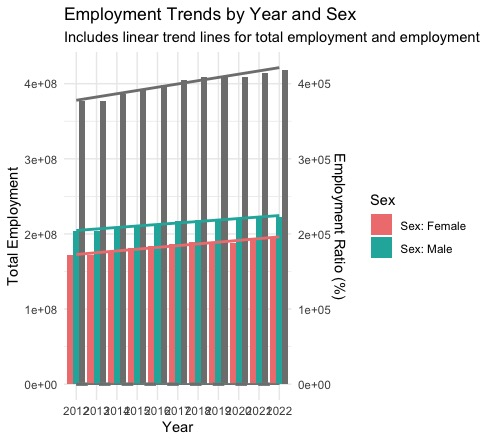
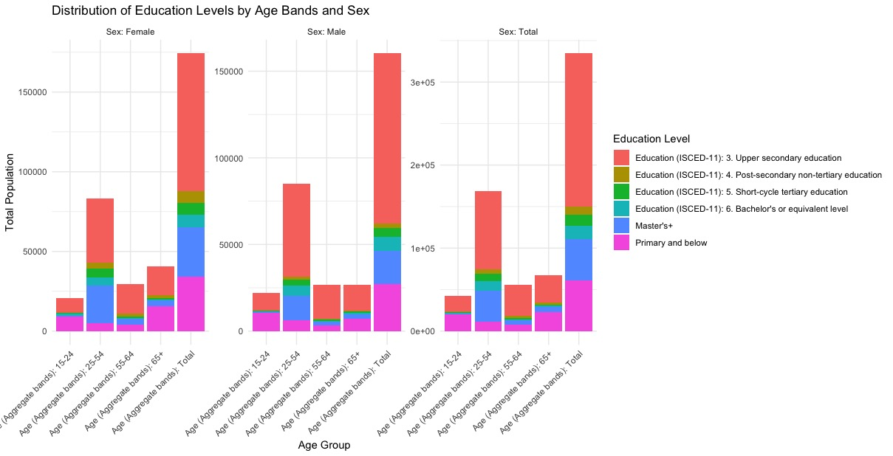
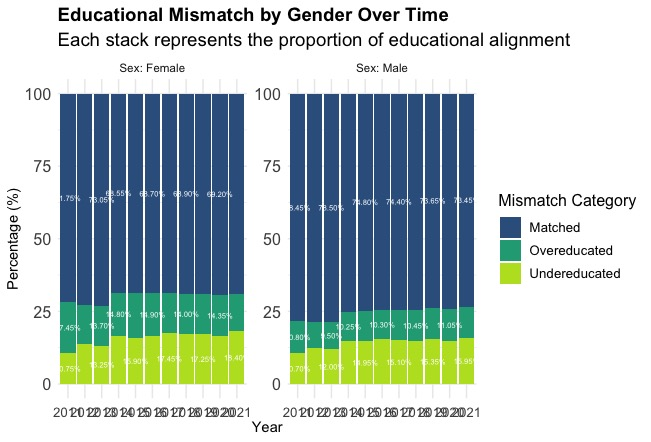
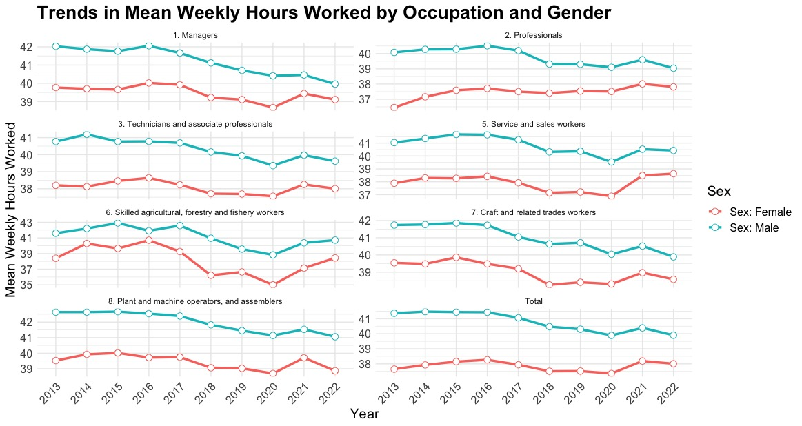
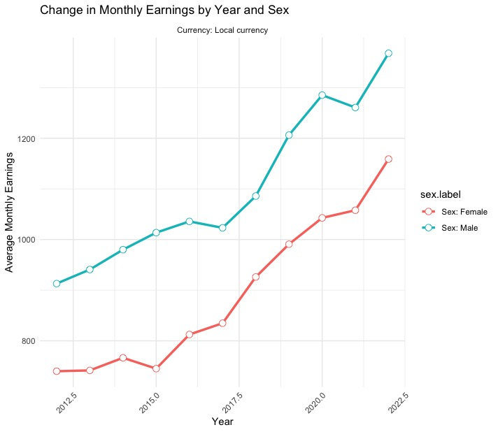
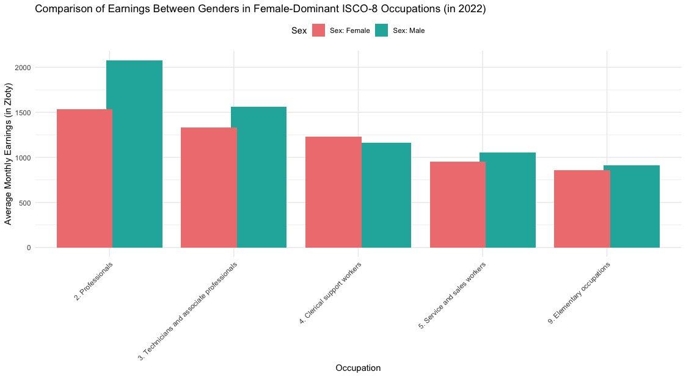

# Poland's Labour Force Analysis in R

This project aims to analyze the labor market in Poland over the span of 10 years, from 2012 to 2022, focusing on employment patterns, educational attainment levels, and monthly earnings. The data was manually collected from ILOSTAT, filtering for Poland, and includes the latest available data up to 2022. The goal is to gain insights into gender inequality, education patterns, and changes in the labor market over the specified period.

## Table of Contents

- [Introduction](#introduction)
- [Datasets](#datasets)
- [Analyses](#analyses)
  - [Employment Trends](#employment-trends)
  - [Educational Attainment](#educational-attainment)
  - [Educational Mismatch](#educational-mismatch)
  - [Occupation Analysis](#occupation-analysis)
  - [Monthly Earnings](#monthly-earnings)
  - [Weekly Hours Worked](#weekly-hours-worked)
- [Key Findings](#key-findings)
- [Installation](#installation)
- [Usage](#usage)
- [License](#license)

## Introduction

This analysis explores the evolving dynamics of the Polish labor force within the context of the economic and political landscape. By examining factors such as employment patterns, educational attainment, and earnings, this project aims to shed light on gender inequality, education trends, and labor market changes in Poland from 2012 to 2022.

## ILOSTAT Datasets

The dataset used for this analysis was manually collected from ILOSTAT, specifically filtering for Poland, and includes the latest available data up to 2022. ILOSTAT, the database of the International Labour Organization (ILO), is a comprehensive source of labor market statistics. The primary data sources for ILOSTAT are the National Statistical Offices (NSOs) of various countries. These offices collect data through household surveys, labor force surveys, censuses, and administrative records.

There are seven different datasets covering various aspects of the labor market in Poland, such as employment trends, education levels, educational mismatch, occupation distribution, and earnings. The data was carefully filtered and cleaned to ensure accuracy and relevance to the analysis objectives. The sources of these datasets are the EU Labour Force Survey.

### Limitations

- Not all countries have comprehensive or up-to-date data for every indicator.
- There can be a time lag between data collection, submission by NSOs, and publication by ILOSTAT. This means that the latest economic changes may not be immediately reflected.
- As with any large dataset, there is a possibility of reporting errors. These could arise from misreporting by respondents, data entry errors, or misinterpretation of survey questions.

## Analyses

### Employment Trends

Analyzes employment trends by year, sex, and population. Merges population and employment ratio data to calculate total employment and average employment ratio.



### Educational Attainment

Examines the distribution of education levels by age bands and sex. Groups education levels and visualizes the distribution across different age groups.




### Educational Mismatch

Investigates educational mismatch by gender over time. Analyzes the proportion of the population that is overeducated, undereducated, or has matched education levels.



### Weekly Hours Worked

Examines trends in mean weekly hours worked in various occupations over time, with a breakdown by gender.




### Monthly Earnings

Analyzes average monthly earnings by sex and education level. Focuses on various job titles and visualizes the changes in earnings over time.




## Comparison of Earnings Between Genders in Female-Dominant ISCO-8 Occupations 

Highlights the gender pay gap in female-dominant occupations for the year 2022. Men tend to earn more on average compared to women across several occupations, including professionals, technicians, and clerical support workers.



## Key Findings

- A steady increase in the employed working-age population.
- Men consistently show higher employment counts.
- The total employment count fell visibly in 2019, likely due to the COVID-19 pandemic and its economic repercussions.
- Upper secondary education (high-school level) is the most common attainment level.
- Younger females show higher proportions of higher education degrees (Bachelor's and Master's).
- Older age groups have lower higher education attainment.
- A significant portion of the population is overeducated or undereducated for their jobs. The mismatch remains relatively consistent over the years, with slight improvements.
- Certain occupations like professionals and managers show a significant gender disparity.
- An upward trend in employment in higher skill levels over the years.
- Across most occupations, males work more hours per week compared to females. There is an upward trend in average weekly hours worked from 2020 to 2021, likely due to the aftermath of the COVID-19 pandemic and economic recovery efforts.
- Consistent increases in earnings across most job categories.
- Persistent gender pay gap, with fluctuations in certain years, particularly around economic downturns or policy changes.
- In almost all female-dominant occupations, males earn more on average compared to females. With one exception, female Clerical Support Workers earn more than males in this category.

## Installation

1. Clone the repository:
   ```sh
   git clone https://github.com/your-username/polands-labour-force-analysis.git
   ```

2. Install requirements:
   ```sh
   pip install -r requirements.txt
   ```

## Usage
1. Navigate to the project directory:
```sh
cd polands-labour-force-analysis
```

2. Open the Jupyter Notebook:
```sh
jupyter notebook poland-s-labour-force-analysis-in-r.ipynb
```

## License
This project is licensed under the MIT License. 
